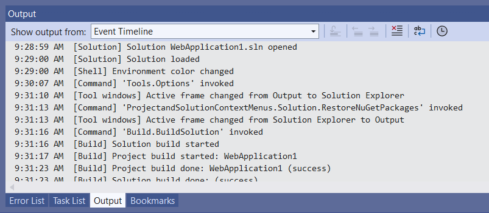
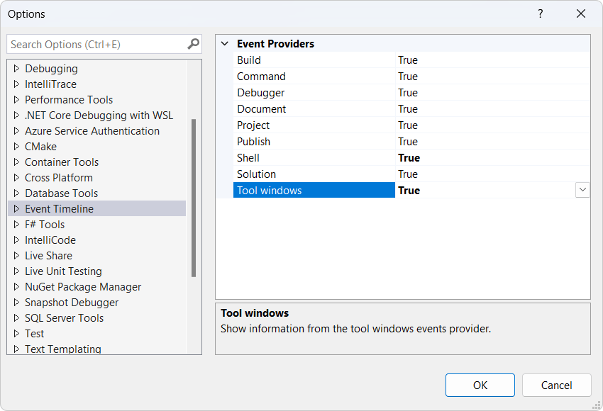

[marketplace]: https://marketplace.visualstudio.com/items?itemName=MadsKristensen.EventLog
[vsixgallery]: http://vsixgallery.com/extension/EventLogVS.a9f6a6f5-4752-4c4d-a142-15340fc800af/
[repo]:https://github.com/madskristensen/EventLogVS

# EmojiSense for Visual Studio

Download this extension from the [Visual Studio Marketplace][marketplace]
or get the [CI build][vsixgallery].

--------------------------------------

Logs all events from the IDE in a timeline in a separate Output Window pane. It let's you diagnose issues and gives you a historic view of your actions in Visual Studio.

You can toggle the differnet providers on and off from the Tools -> Options dialog.

## How can I help?
If you enjoy using the extension, please give it a ★★★★★ rating on the [Visual Studio Marketplace][marketplace].

Should you encounter bugs or if you have feature requests, head on over to the [GitHub repo][repo] to open an issue if one doesn't already exist.

Pull requests are also very welcome, since I can't always get around to fixing all bugs myself. This is a personal passion project, so my time is limited.

Another way to help out is to [sponsor me on GitHub](https://github.com/sponsors/madskristensen).
